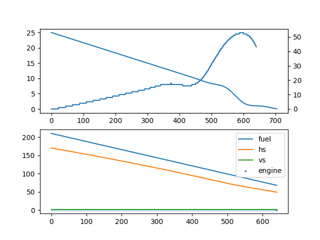

# Matala Bereshit:
1. Bereshit.xlsx: Excel which contains 4 tabs:
- Real: Grabbed the data from TV.
- Manual Driving
- Final Results: The results captured from the Java program. Those are based on the auto driving.
2. PDF: Investigation.

# Results:
There are 3 algorithms:
1. A controller based on the manual driving:

2. A controller based on interpolation functions:

3. A controller based on interpolation function and simple PID:
